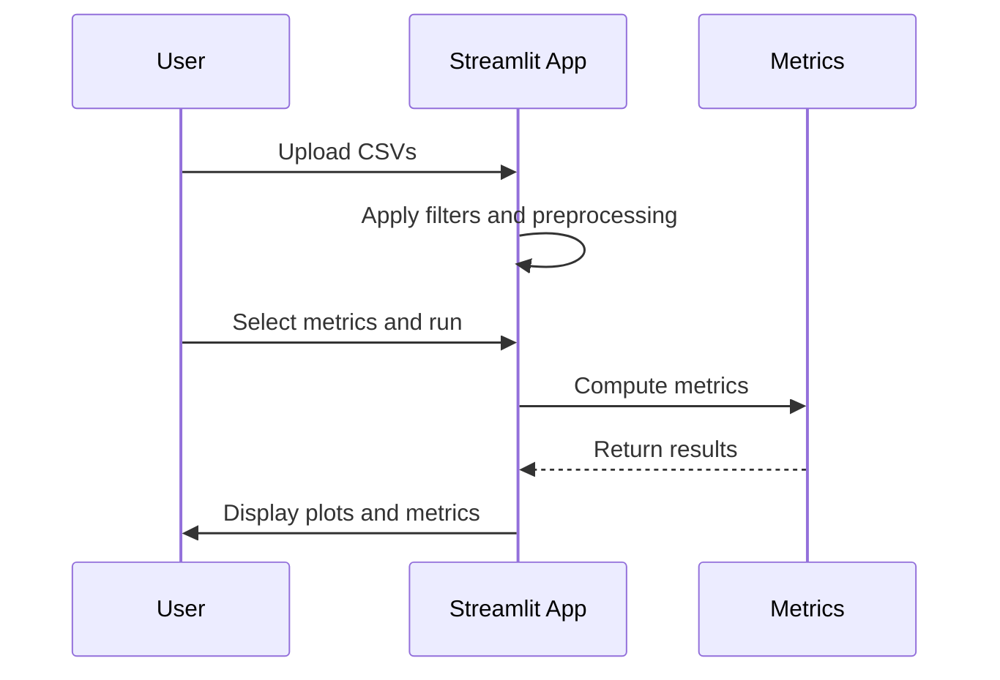

<!-- # Copyright (c) 2025 takotime808 -->
# multioutreg #

Multi-Output Multi-Fidelity Surrogate Modeling with Uncertainty Quantification.

[](https://multioutreg.streamlit.app/)
[](https://takotime808.github.io/multioutreg/)
[](https://www.python.org/)
<!-- [](https://pypi.org/project/multioutreg/) -->
<!-- [](./LICENSE) -->
<!-- [](https://github.com/takotime808/multioutreg/actions/workflows/python-ci.yml) -->
<!-- [](https://github.com/takotime808/multioutreg/actions/workflows/streamlit-smoke.yml) -->

Previous deployment:

[](https://multioutreg-sample.streamlit.app/)

This repository provides utilities for evaluating multi-output surrogate models
with uncertainty estimation. Example notebooks in `examples/` demonstrate the
plotting functions and performance metrics. A new script `examples/report.py`
shows how to create an HTML report using a Jinja2 template that collects all
metrics and figures in one document. Output reports are shown in the docs
directory: [example_reports](docs/example_reports/).

The `AutoDetectMultiOutputRegressor` can now automatically search across all
vendor-provided surrogates. See [`examples/AutoDetectMultiOutputRegressor.ipynb`](./examples/AutoDetectMultiOutputRegressor.ipynb) 
for a short demonstration.

----
### 📦 Features ###

- 🧠 Auto-detect best multi-output regressors with uncertainty support.
- 📉 Per-target metrics, SHAP plots, UMAP projections, PDPs, residuals.
- 📊 Exportable HTML reports and Streamlit dashboards.
- 📁 Sphinx documentation with autodoc, tutorials, and CLI docs.
- 🧪 Fully tested with `pytest` and integrated CI.

---
### 🚀 Quickstart ###

**Installation:**
```bash
pip install .[test]  # optional: for testing and dev
```

**Streamlit App:**
```sh
streamlit run multioutreg/gui/Grid_Search_Surrogate_Models.py
```

[Notebooks and scripts](examples/) can be run once the tool is installed.

**CLI:**

```sh
multioutreg
```

Example use command:
```sh
multioutreg grid_search_auto_detect docs/_static/example_datasets/sample_data.csv "x0,x1,x2,x3,x4,x5" "y0,y1"
```

Help menu for any command can be called with flag:
```sh
multioutreg grid_search --help
```

----
### ☁️ Deployments ###

🖥️ The deployed Streamlit application is available at:  
[https://multioutreg-report.streamlit.app/](https://multioutreg-report.streamlit.app/)

📂 Example input files for testing the app can be found here:  
[./docs/_static/example_datasets/](./docs/_static/example_datasets/)

----
## Visual Overview

### Sequence of Interactions

