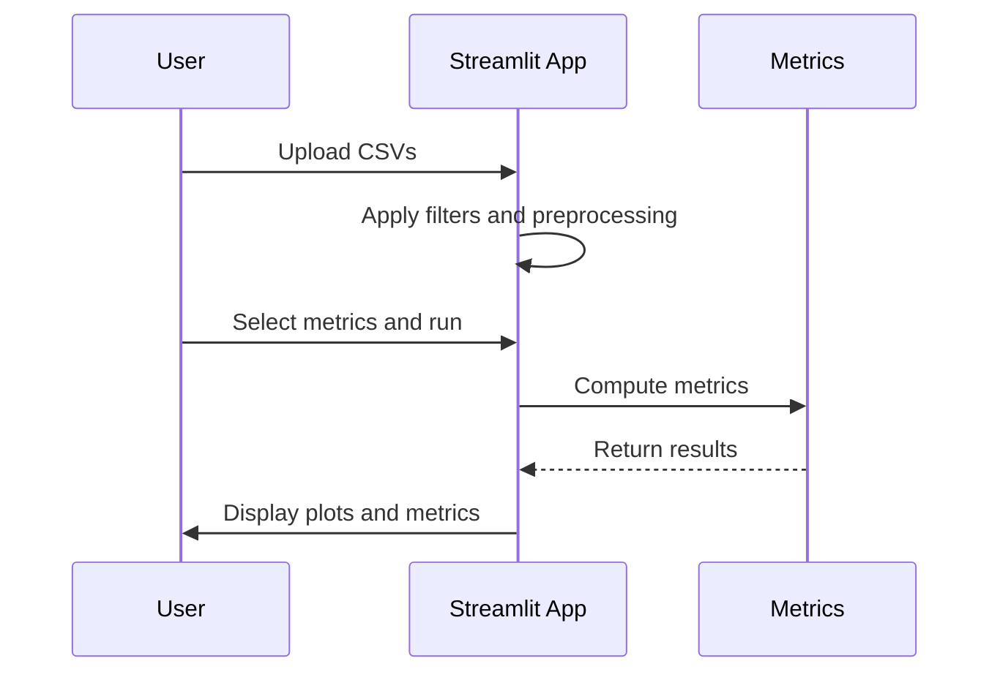

<!-- # Copyright (c) 2025 takotime808 -->
# multioutreg #

Multi-Output Multi-Fidelity Surrogate Modeling with Uncertainty Quantification.

[](https://multioutreg.streamlit.app/)
[](https://takotime808.github.io/multioutreg/)
[](https://www.python.org/)


[](https://github.com/takotime808/multioutreg/actions/workflows/gh_pages.yml)

<!-- [](https://pypi.org/project/multioutreg/) -->
<!-- [](./LICENSE) -->
<!-- [](https://github.com/takotime808/multioutreg/actions/workflows/python-ci.yml) -->
<!-- [](https://github.com/takotime808/multioutreg/actions/workflows/streamlit-smoke.yml) -->

<!-- Moo-regret deployment:

[](https://multioutreg-regret.streamlit.app/) -->


This repository provides utilities for evaluating multi-output surrogate models
with uncertainty estimation. Example notebooks in `examples/` demonstrate the
plotting functions and performance metrics. A new script `examples/report.py`
shows how to create an HTML report using a Jinja2 template that collects all
metrics and figures in one document. Output reports are shown in the docs
directory: [example_reports](docs/example_reports/). In order to run all the 
examples, some dependencies need to be installed with `pip install -e .[examples]`.

The `AutoDetectMultiOutputRegressor` can now automatically search across all
vendor-provided surrogates. See [`examples/AutoDetectMultiOutputRegressor.ipynb`](./examples/AutoDetectMultiOutputRegressor.ipynb) 
for a short demonstration.

----
## 📦 Features ##

- 🧠 Auto-detect best multi-output regressors with uncertainty support.
- 📉 Per-target metrics, SHAP plots, UMAP projections, PDPs, residuals.
- 📊 Exportable HTML reports and Streamlit dashboards.
- 📁 Sphinx documentation with autodoc, tutorials, and CLI docs.
- 🧪 Fully tested with `pytest` and integrated CI.

---
## 🚀 Quickstart ##

**Installation:**
```bash
pip install -e .[all]  
```
- `[all]` is optional: it will include deps that are
  - model specific 
  - for testing
  - for dev work
  - everything except the deps only needed to run the examples: `[examples]`

**Streamlit App:**
```sh
streamlit run multioutreg/gui/Grid_Search_Surrogate_Models.py
```

[Notebooks and scripts](examples/) can be run once the tool is installed.

**CLI:**

```sh
multioutreg
```

Example use command:
```sh
multioutreg grid_search_auto_detect docs/_static/example_datasets/sample_data.csv "x0,x1,x2,x3,x4,x5" "y0,y1"
```

Help menu for any command can be called with flag:
```sh
multioutreg grid_search --help
```

Time series forecasting — two commands are available depending on what you need:

| Command | Approach | When to use |
|---|---|---|
| `ts-forecast` | Zero-shot (Chronos foundation model) | No training data required; fast probabilistic quantile forecasts from a pre-trained model |
| `ts-pipeline` | Trained statistical + deep models (ARIMA, SARIMA, LSTM) | You want to fit models on your own data, rank them by RMSE/MAE/MAPE, and save the best one |

**`ts-forecast`** — CLI for zero-shot forecasting with Chronos / Chronos-Bolt:
```sh
multioutreg ts-forecast data.csv \
  --time-col "Date" \
  --value-cols "revenue" \
  --horizon 30 \
  --model amazon/chronos-bolt-base \
  --out forecast.csv
```

**`ts-pipeline`** — CLI for training ARIMA / SARIMA / LSTM time series models via the ts_dynamic_fit pipeline:
```sh
multioutreg ts-pipeline data.csv \
  --target-col "revenue" \
  --datetime-col "Date" \
  --freq 1D \
  --out-dir ts_pipeline_output/
```

Key differences:
- `ts-forecast` requires no training; `ts-pipeline` trains models on the provided CSV and saves the best to `--out-dir`.
- `ts-forecast` outputs quantile forecasts (e.g. p10/p50/p90); `ts-pipeline` outputs a ranked comparison table and serialized model.
- `ts-pipeline` automatically aggregates row-level data (e.g. one row per order) to the target frequency, and converts percentage-formatted columns to numeric.
- `ts-pipeline` also accepts `--agg` (default `sum`) to control how duplicate timestamps are collapsed.

Full option reference:
```sh
multioutreg ts-forecast --help
multioutreg ts-pipeline --help
```

----
## ☁️ Deployments ##

🖥️ The deployed Streamlit application is available at:  
[https://multioutreg-report.streamlit.app/](https://multioutreg-report.streamlit.app/)

📂 Example input files for testing the app can be found here:  
[./docs/_static/example_datasets/](./docs/_static/example_datasets/)

----
## Visual Overview

### Sequence of Interactions


```mermaid
sequenceDiagram
    participant U as User
    participant S as Streamlit App
    participant M as Metrics
    U->>S: Upload CSVs
    S->>S: Apply filters and preprocessing
    U->>S: Select metrics and run
    S->>M: Compute metrics
    M-->>S: Return results
    S->>U: Display plots and metrics
```