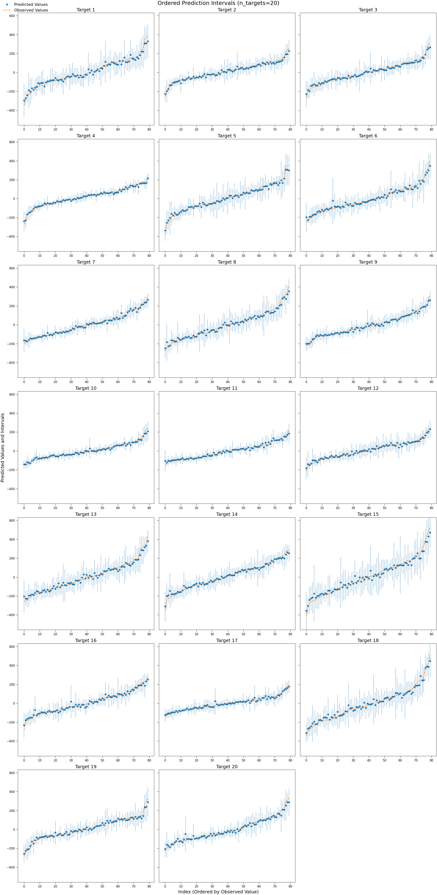

<!-- # Copyright (c) 2025 takotime808 -->

# Figures #

See example notebooks in `{root_dir}/examples/` for how to generate figures with functions in this module.


**`generate_umap_plot` Classification Table**

| Metric             | Grid   | LHS       | Random | Sobol     |
| ------------------ | ------ | --------- | ------ | --------- |
| `std_dist`         | < 0.05 | 0.05–0.15 | > 0.2  | 0.05–0.15 |
| `silhouette_score` | > 0.6  | \~0.4     | < 0.3  | \~0.4     |
| `entropy`          | low    | high      | high   | low       |


----

**Multi-output ordered interval plots:**

```python
import numpy as np
import matplotlib.pyplot as plt
from sklearn.datasets import make_regression
from sklearn.ensemble import RandomForestRegressor
from sklearn.multioutput import MultiOutputRegressor

from multioutreg.figures.confidence_intervals import (
    plot_intervals_ordered_multi,
)


# --- n_targets=2 example ---
n_targets = 20
X, y = make_regression(n_samples=80, n_features=4, n_targets=n_targets, noise=8, random_state=0)
model = MultiOutputRegressor(RandomForestRegressor(n_estimators=30, random_state=42)).fit(X, y)
y_pred = model.predict(X)
y_std = np.zeros_like(y_pred)
for i, est in enumerate(model.estimators_):
    all_preds = np.stack([tree.predict(X) for tree in est.estimators_], axis=1)
    y_std[:, i] = all_preds.std(axis=1)

target_list = ["Target {i}" for i in range(n_targets)]

plot_intervals_ordered_multi(
    y_pred, y_std, y,
    suptitle="Ordered Prediction Intervals",
    max_cols=3,
    base_width=8,
    base_height=7,
    target_list=target_list,
    # savefig="../../docs/_static/images/intervals_ordered_multi.png",
)
```

